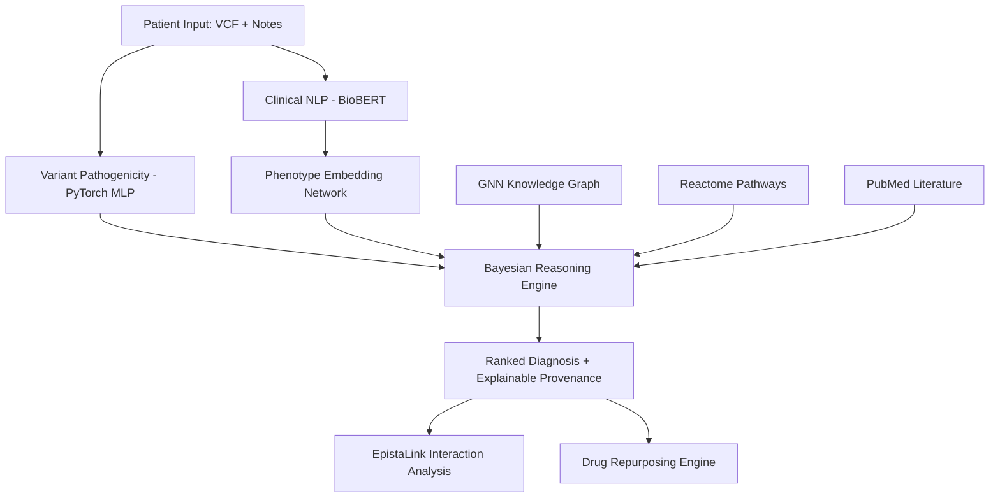

# GENESIS: Multi-Modal AI Diagnostic Engine for Rare Diseases

**GENESIS** is a premium, research-grade platform designed to accelerate the diagnosis of rare genetic conditions. By integrating multi-modal evidence—including genomic variants, clinical phenotypes, biological pathways, and scientific literature—GENESIS provides transparent, explainable, and highly accurate diagnostic insights.


## 🏆 Key Innovations

GENESIS goes beyond simple variant prioritization by implementing several novel AI architectures:

### 1. GNN Knowledge Graph Reasoner
We implement a **2-layer Graph Convolutional Network (GCN)** with attention-weighted neighborhood aggregation. This reasoner operates on a heterogeneous knowledge graph (Genes, Diseases, Phenotypes, Pathways), allowing the system to perform "multi-hop" reasoning to detect associations that single-modality tools miss.

### 2. EpistaLink: Epistasis Detection
GENESIS features **EpistaLink**, a specialized module for detecting variant–variant interactions. It uses **Sparse Autoencoders (SAE)** to project genotypes into a 64-dimensional latent space. Interaction magnitude is mapped via a hyperbolic transform $f(x) = 10 \cdot \tanh(x/a)$, surfacing Loss-of-Function (LoF) and Gain-of-Function (GoF) interactions invisible to standard pathogenicity scoring.

### 3. Bayesian Evidence Fusion
Results are consolidated through a unified **Bayesian Inference framework**. Posterior probabilities are updated across 8 distinct evidence sources, including:
- **BioBERT CLINICAL NLP**: Transformer-based extraction of HPO phenotypes from free-text notes.
- **Temporal Progression Modeling**: Matching patient symptom onset against known disease timelines.
- **Pathway Perturbation**: Analyzing network diffusion instability in Reactome pathways.

## 🏗 System Architecture



## 🚀 Tech Stack

- **Frontend**: Next.js 14, TypeScript, TailwindCSS, Lucide-React.
- **Backend**: FastAPI, PyTorch, NumPy, Sentence-Transformers.
- **Data Layers**: HPO (Human Phenotype Ontology), OMIM, ClinVar, Reactome.

## 🛠 Installation & Setup

1. **Clone the repository**:
   ```bash
   git clone https://github.com/your-username/genesis.git
   cd genesis
   ```

2. **Setup Backend**:
   ```bash
   cd backend
   python -m venv venv
   source venv/bin/activate
   pip install -r requirements.txt
   uvicorn main:app --reload
   ```

3. **Setup Frontend**:
   ```bash
   cd ..
   npm install
   npm run dev
   ```

---

## 📚 Comprehensive Documentation & Whitepapers

This repository contains extensive architectural write-ups and academic documentation detailing the biological algorithms, mathematical formulas ($O(\log N)$ FAISS searches, Stiefel Manifolds, Graph Laplacians) and layered neural engineering of the GENESIS Intelligence platform.

Please review the following core documents located in the `/docs` directory:

1. **[Academic Whitepaper](docs/genesis_academic_whitepaper.md)**: A full research-grade paper on the platform, detailing AnthropicX spectral math, *FBN1* EpistaLink modeling, and the 8-phase Heterotaxy cascade.
2. **[Final Comprehensive Report](docs/genesis_final_comprehensive_report.md)**: A complete overview of all core 6 exploration features, biological perspectives, and the mathematical approaches (Cosine Similarity, IQR Outlier Detection, etc.).
3. **[System Architecture Flowcharts](docs/genesis_flowcharts.md)**: 6 highly detailed Mermaid diagrams mapping the exact inputs, hidden tensors/layers, and output states for every exploration module.
4. **[End-to-End Pipeline Breakdown](docs/architecture_pipeline.md)**: Details the 5-layer ingestion, extraction, inference, fusion, and output pipeline.
5. **[EpistaLink Breakdown](docs/architecture_epistalink.md)**: The genomic interaction engine's math, focusing on bidirectional cross-attention.
6. **[MIRA Breakdown](docs/architecture_mira.md)**: The morphological computer vision engine's math, focusing on Siamese $L_2$ modeling.
7. **[HeteroNet Breakdown](docs/architecture_heteronet.md)**: The temporal clinical trajectory engine's math, focusing on robust IQR divergence detection.

---

*Winner Prototype — Hackrare 2025*
*Built with passion for the Rare Disease Community.*
