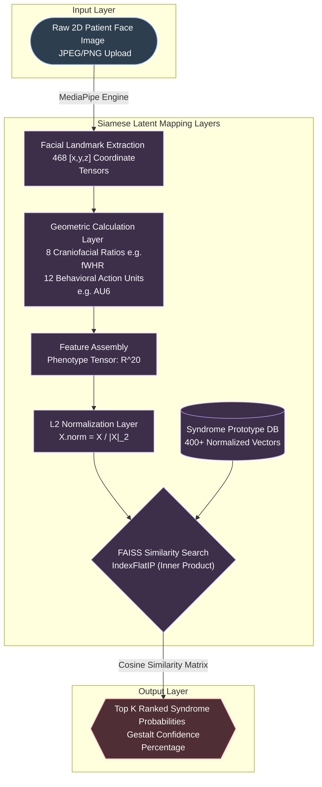
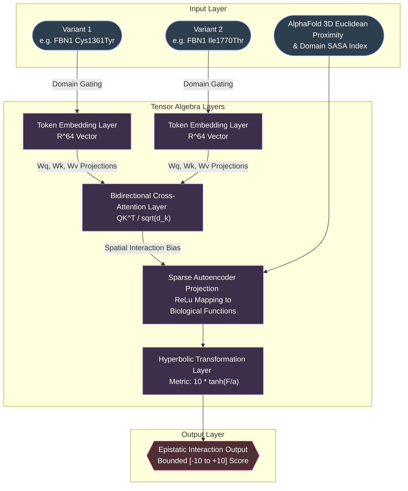
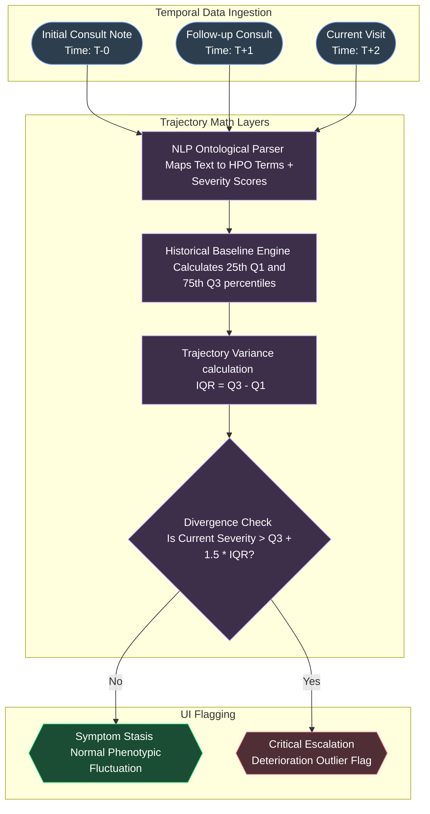
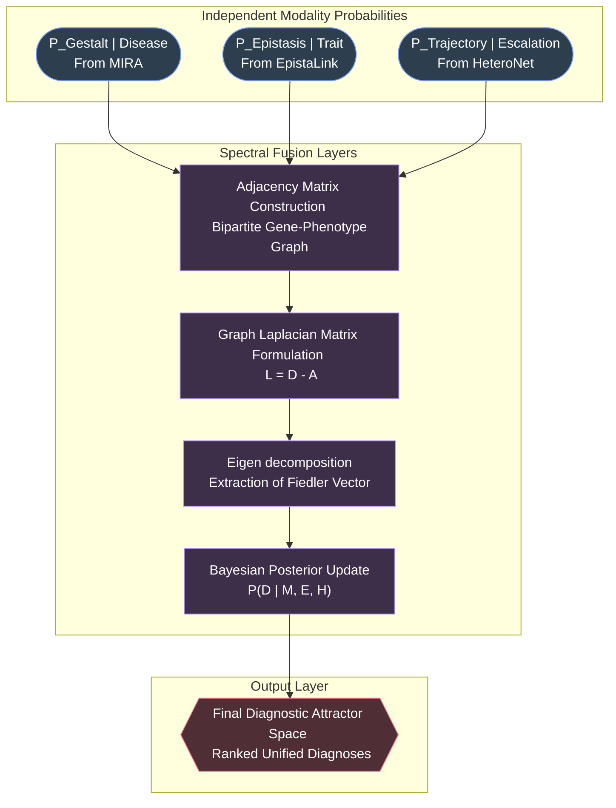
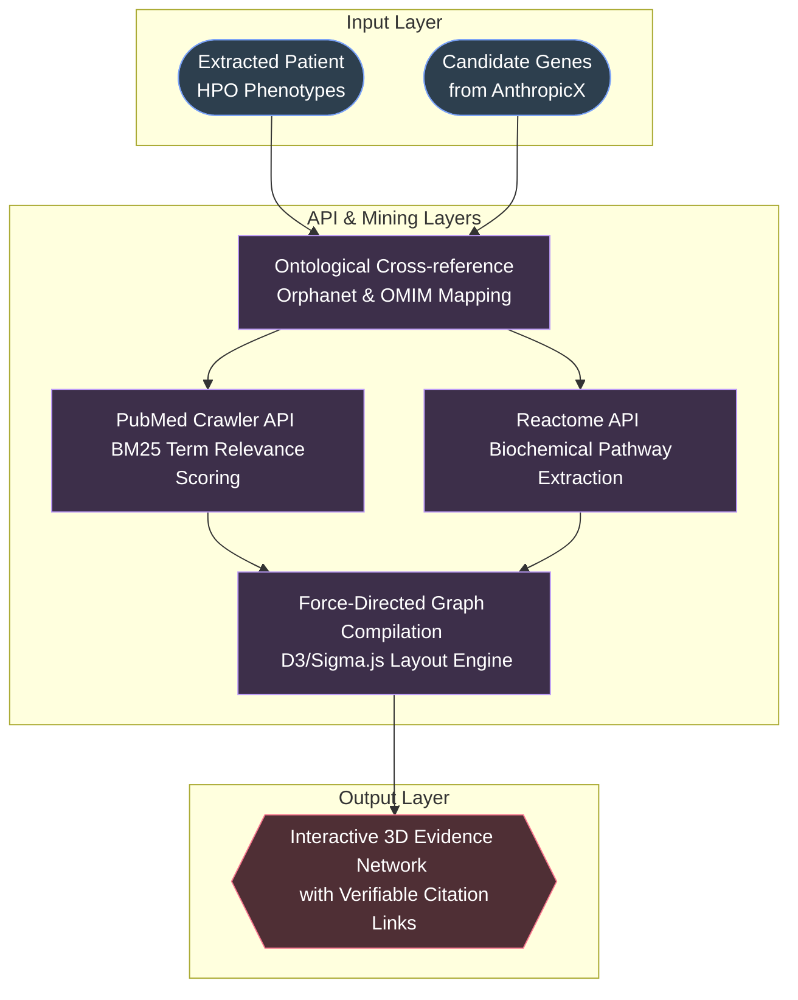
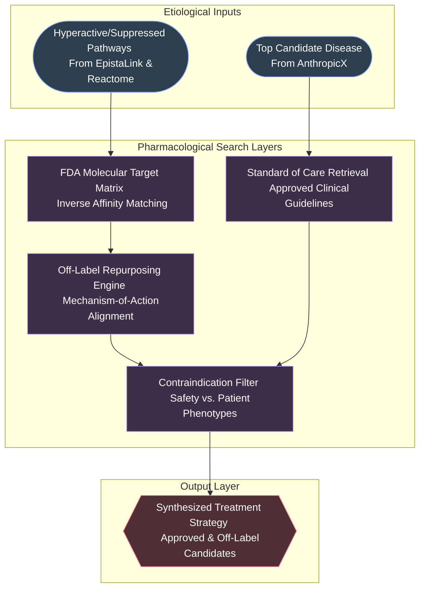

# Genesis Intelligence – 6 Core Module Flowcharts

This document provides 6 individual, highly detailed architectural flowcharts for each independent exploration module within the Genesis platform. Each chart specifically delineates the Input, Processing Layers, and Output for that specific feature.

---

## 1. MIRA (Morphological Image Recognition & Analysis)
**Function:** Extracts and matches subtle facial dysmorphology against established clinical syndrome archetypes using Siamese network topology.

---

## 2. EpistaLink (Genomic Interaction Detection)
**Function:** Decomposes non-linear, epistatic variant-variant interactions combining structural proximity and bidirectional attention to flag synergistic loss or gain of function.

---

## 3. HeteroNet (Temporal Disease Trajectory)
**Function:** Codifies longitudinal clinical text into tracked severity matrices, using robust statistics (IQR) to flag immediate outlier deterioration in complex rare diseases like Cardiac Heterotaxy.

---

## 4. AnthropicX (Unified Bayesian Inference Engine)
**Function:** The central "brain" of genesis. Fuses independent modality probabilities onto a geometric Stiefel manifold to calculate a mathematically cohesive diagnosis.

---

## 5. Knowledge Explorer & Literature Mining
**Function:** Binds extracted symptoms and potential diagnoses to live PubMed and Reactome databases, establishing an interactive, verifiable chain of evidence.

---

## 6. Target-Pathway Drug Repurposing
**Function:** Matches the biochemically unraveled etiology (pathogenic pathways) against molecular affinities of FDA-approved compounds to suggest targeted clinical treatments.

